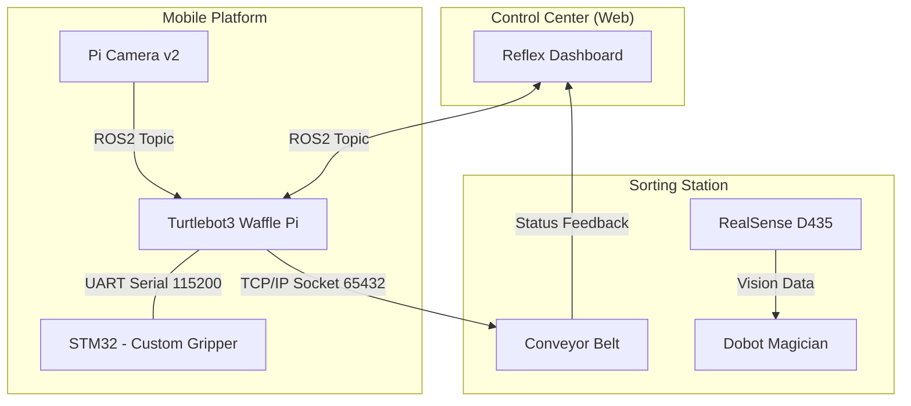

# 🧺 Smart Home Laundry Automation System
**Turtlebot3와 Dobot을 활용한 무인 세탁물 운반 및 분류 자동화 솔루션** 

## 🏗️ 시스템 아키텍처 (System Architecture)



## 🚀 프로젝트 개요 (Overview)
* **목표**: 주거 공간 내 세탁물 관리의 번거로움 해소 및 가사 노동 무인화 요구 증대 대응 .
* **핵심 내용**: Turtlebot3, Dobot, Conveyor 연동을 통한 세탁물 수거·분류·이송 전 과정 자동화 구현 .
* **주요 성과**: 
    * LiDAR 데이터 전처리 및 33cm 반경 정밀 튜닝 기반 실내 고속 자율 주행 달성 .
    * 직접 학습시킨 YOLOv8 nano 모델 기반 객체 인식 정확도 99.5% 확보 .
    * ROS2 Topic과 TCP/IP Socket 통신을 결합한 이기종 하드웨어 간 통합 제어 구현 .

## 🛠 기술 스택 (Tech Stack)
### Hardware 
* **Mobile**: Turtlebot3 Waffle Pi 
* **Manipulator**: Dobot Magician , Custom Gripper & Lift (3D Printed 설계) 
* **Controller**: STM32 (NUCLEO-F103RB) , Raspberry Pi 
* **Sensor**: Intel RealSense , Pi Camera , LiDAR 

### Software 
* **OS**: Ubuntu 22.04 , Raspbian 
* **Framework**: ROS2 Humble , STM32 HAL Library 
* **AI/Vision**: YOLOv8 nano , OpenCV 
* **Web**: Reflex (Full-stack Web Framework) 

## ⚙️ 설치 및 실행 방법 (Installation & Setup)

### 1. 워크스페이스 빌드 
```bash
# 패키지 생성 및 의존성 설치
cd ~/ros2_ws/src
ros2 pkg create --build-type ament_python turtlebot_distance_checker --dependencies rclpy sensor_msgs cv_bridge std_msgs

# 빌드 및 환경 설정
colcon build && source ~/.bashrc
```

### 2. 실제 하드웨어 실행 순서 
1. **[터틀봇] Bringup 실행**: 
    ```bash
    ros2 launch turtlebot3_bringup robot.launch.py usb_port:=/dev/ttyACM1
    ```

2. **[터틀봇] Pi Camera 노드 실행**: 
    ```bash
    ros2 run v412_camera v412_camera_node --ros-args -p image_size:=[160,160] -p framerate:=2.0 --video_device:="/dev/video0"
    ```

3. **[원격 PC] Navigation2 실행**: 
    ```bash
    ros2 launch turtlebot3_navigation2 navigation2.launch.py map:=/home/ssafy/final_map_1.yaml
    ```
4. **[터틀봇] 그리퍼 브릿지(STM32 연결) 실행**: 
    ```bash
    ros2 run gripper_bridge gripper_bridge
    ```
5. **[원격 PC] 통합 제어 및 자율주행 스크립트 실행**: 
    ```bash
    python3 final_patrol_grip.py
    ```

## 📡 주요 통신 및 제어 로직
* **통합 제어**: `gripper_cmd` 토픽의 'q' 데이터를 모니터링하여 TCP/IP 소켓 명령으로 변환 후 컨베이어 동작 트리거 .
* **STM32 제어**: USART/I2C/PWM 인터페이스 커스터마이징을 통한 고정밀 모터 제어 및 I2C LCD 상태 출력 .
* **네트워크 설정**: 컨베이어 IP `192.168.110.150`, 포트 `65432` 사용 .